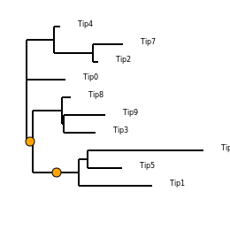

# Gotree: toolkit and api for phylogenetic tree manipulation

## Commands

### draw
This command draws trees with basic functionalities. It implements 3 layouts (normal, radial, circular) and 3 output formats (text, png and svg). Different options are possiblem such as drawing cirlces at highly supported branches, etc.

#### Usage

```
Usage:
  gotree draw [command]

Available Commands:
  png         Draw trees in png files
  svg         Draw trees in svg files
  text        Print trees in ASCII

Flags:
  -i, --input string           Input tree (default "stdin")
      --no-branch-lengths      Draw the tree without branch lengths (all the same length)
      --no-tip-labels          Draw the tree without tip labels
  -o, --output string          Output file (default "stdout")
      --support-cutoff float   Cutoff for highlithing supported branches (default 0.7)
      --with-branch-support    Highlight highly supported branches
      --with-node-labels       Draw the tree with internal node labels
```

#### Example

* SVG image, radial layout with branch supports
```
gotree generate yuletree -s 10 | gotree randsupport -s 10 | gotree draw svg -r -w 200 -H 200 --with-branch-support --support-cutoff 0.7 -o commands/draw_1.svg
```


* SVG image, circular layout with branch supports
```
gotree generate yuletree -s 10 | gotree randsupport -s 10 | gotree draw svg -c -w 200 -H 200 --with-branch-support --support-cutoff 0.7 -o commands/draw_2.svg
```


* SVG image, norman layout with branch supports
```
gotree generate yuletree -s 10 | gotree randsupport -s 10 | gotree draw svg -w 200 -H 200 --with-branch-support --support-cutoff 0.7 -o commands/draw_3.svg
```



